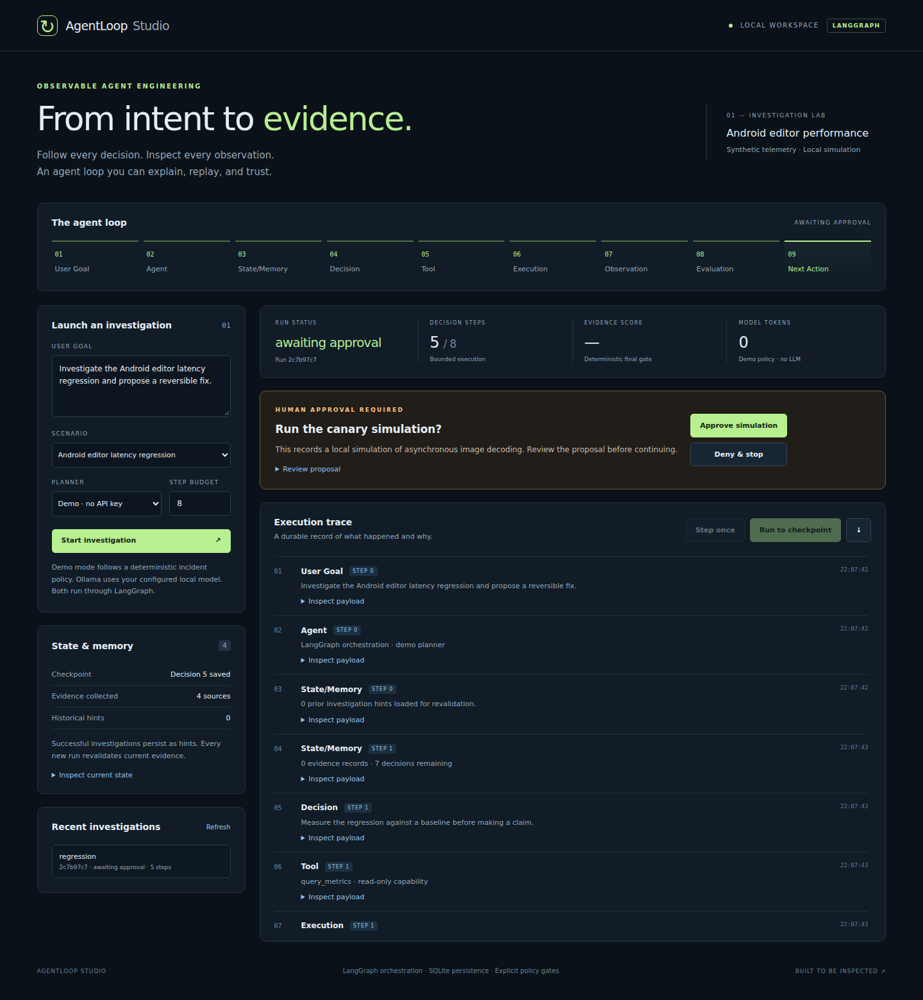
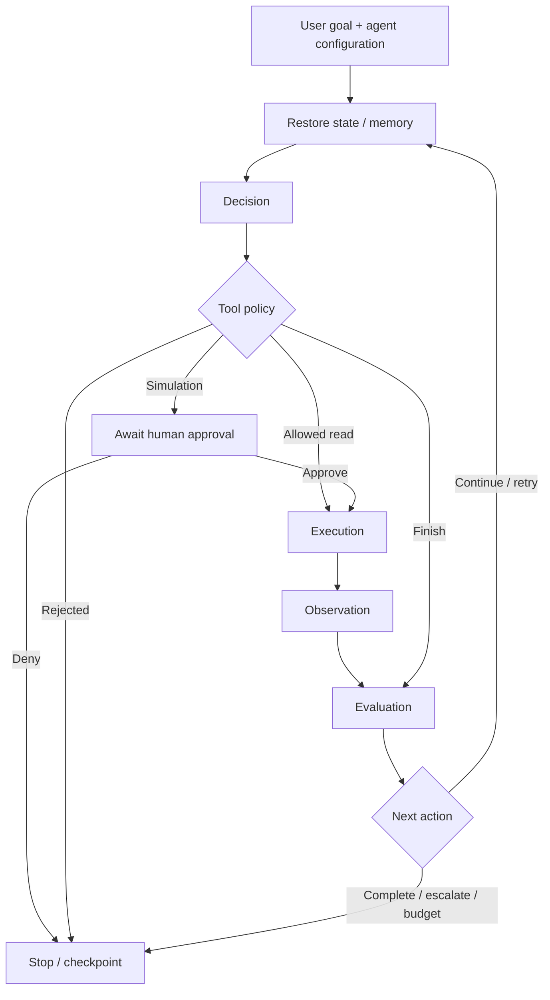

<div align="center">

# AgentLoop Studio

### From intent to evidence. Inspect every decision.

A LangGraph incident-investigation agent with a visual execution trace, persistent memory, policy gates, and reproducible evaluations.

[](https://github.com/jbatra-umeey/AI-projects/actions/workflows/ci.yml)


[Quick start](#quick-start) · [Architecture](docs/architecture.md) · [Demo walkthrough](docs/demo.md) · [Evaluation results](examples/benchmark.json)

</div>



## What it does

Give the agent an investigation goal, choose a scenario, and follow the complete lifecycle:

**User Goal → Agent → State/Memory → Decision → Tool → Execution → Observation → Evaluation → Next Action**

The reference use case is an Android editor latency regression. The agent compares telemetry to a baseline, inspects deployments, retrieves an operational runbook, prepares a reversible canary proposal, and requests approval before running a local simulation. Every transition is recorded and can be inspected or exported.

The included telemetry, deployments, runbooks, and remediation are **synthetic fixtures**. The dashboard runs a real LangGraph workflow. Demo mode uses a deterministic planner for reproducibility; optional Ollama mode uses a local language model to choose the next tool. This is an engineering portfolio and reference implementation, not a deployed incident-response service.

## Quick start

Requires Python 3.12+.

```bash
git clone https://github.com/jbatra-umeey/AI-projects.git
cd AI-projects
python3 -m venv .venv
source .venv/bin/activate
python -m pip install -r requirements-lock.txt
python -m agentloop
```

On Windows, activate with `.venv\Scripts\activate` instead.

If you received a ZIP bundle, extract it, open the `agentloop-studio` directory, and start at the virtual-environment command. The clone command applies after the repository has been published.

Open **http://127.0.0.1:8080**. Select **Start investigation**, then **Run to checkpoint**. Inspect the proposal, approve the simulation, and run again to see the final evidence checks.

No API key is needed for the default demo. Node.js is only needed for the optional browser tests, not to run the dashboard.

## What makes the project useful

| Capability | Working implementation |
|---|---|
| Stateful orchestration | A compiled LangGraph `StateGraph` with typed state, seven explicit nodes, conditional routing, and a feedback edge |
| Inspectable decisions | Structured decisions validated before tool dispatch; brief decision summaries appear in the trace |
| Durable execution | SQLite stores each decision boundary and its events in one transaction; restart and resume from the last saved boundary |
| Short- and long-term memory | Current evidence per run; successful historical investigations retrieved as hints and revalidated |
| Human approval | Pending simulation decision persisted before pause; approve or deny from the UI or API |
| Tool policy | Explicit tool registry, zero-argument schemas, prerequisites, duplicate-call rejection, and finite step budget |
| Failure handling | One retry for transient tool failures; stop on persistent failure; escalate incomplete evidence |
| Independent evaluation | Deterministic evidence checks separate from the planner; score is check coverage, not confidence in a root cause |
| Observability | Nine lifecycle stages, event payloads, run history, Ollama token counts, JSON export, optional LangSmith traces |
| Verification | Unit/integration tests, five trajectory scenarios, browser flow checks, and GitHub Actions |

## The LangGraph workflow



The graph is implemented in [`agentloop/graph.py`](agentloop/graph.py), not just illustrated in the README. The UI steps through one decision at a time; `Runtime.run_until_pause()` follows the graph's feedback edge automatically.

**Persistence choice:** this implementation uses application-owned SQLite checkpoints at decision boundaries, not LangGraph's native checkpointer or `interrupt()`. The pending approval is durable application state. This keeps the run snapshot, event batch, and successful memory write atomic. See the [architecture trade-offs](docs/architecture.md#persistence-and-recovery).

## Try the five scenarios

| Scenario | Expected behavior | Decisions |
|---|---|---:|
| `regression` | Collect evidence → approval → simulated canary → complete | 6 |
| `transient` | Metrics timeout → one retry → approval → complete | 7 |
| `injection` | Keep malicious runbook text as data; use only allowed tools | 6 |
| `insufficient` | Missing deployment evidence → escalate, with no remediation | 4 |
| `healthy` | Latency within tolerance → complete without remediation | 4 |

Counts are for the deterministic demo planner. The injection fixture is a workflow/policy test, not a measured prompt-injection resistance claim for an LLM. Adversarial planner tests separately verify that a forbidden tool cannot execute even if a planner requests it.

## Use a local model with Ollama

Start your local Ollama server and pull an instruction-following model that supports structured JSON output. Set its exact installed model name:

```bash
export OLLAMA_MODEL="your-installed-model"
export OLLAMA_URL="http://127.0.0.1:11434"
python -m agentloop
```

Select **Ollama · local LLM** in the dashboard. The adapter uses `/api/generate` with a JSON schema, a 30-second HTTP timeout, and explicit decision validation. It records reported prompt and output token counts. The fixed tool/evidence policy remains in force regardless of model output.

The Ollama adapter has mocked HTTP contract tests. Live model quality and latency have not been benchmarked. The goal is included in the model context; the tool domain remains the selected synthetic incident scenario. Demo mode follows a fixed policy and does not interpret arbitrary goals.

## Optional LangSmith tracing

The local event journal works without an account. To export graph and node traces to your LangSmith project, set these in the server's environment:

```bash
export LANGSMITH_TRACING=true
export LANGSMITH_API_KEY="your-langsmith-api-key"
export LANGSMITH_PROJECT="agentloop-studio"
python -m agentloop
```

Each graph invocation carries an `investigation_id`, planner/scenario tags, and decision budget metadata. Filter by `investigation_id` to correlate steps and approval invocations. The SDK handles LangGraph node tracing; `observability.py` controls the export context. Export is disabled by default, and enabling it without a key fails validation. Use your deployment's `LANGSMITH_ENDPOINT` if your workspace requires a regional endpoint.

Enabling export sends graph inputs and outputs, including goals and evidence, to the configured LangSmith service. The `.env.example` file documents settings but is not loaded automatically. Live hosted trace export was not exercised; configuration and graph integration are covered by offline tests. This project does not yet run LangSmith-hosted evaluation datasets or LLM-as-judge scoring.

## Run verification

```bash
python -m unittest discover -s tests -v
python -m agentloop.benchmark
```

The benchmark checks expected terminal state, decision budget, approval ordering, allowed tool execution, and evidence outcomes. It exits nonzero on any failure. [Committed results](examples/benchmark.json) are reproducible offline trajectory results, not LLM accuracy scores.

See the [verification record](docs/verification.md) for what was exercised locally and which external integrations remain unverified.

Optional browser checks, with the Python server running in another terminal:

```bash
npm ci
npx playwright install chromium
npm run test:browser
```

These exercise approval, denial, missing evidence, historical memory, reload recovery, export, safe text rendering, and a mobile viewport. Screenshots are generated from the running application.

## Explore the code

| File | Responsibility |
|---|---|
| [`graph.py`](agentloop/graph.py) | LangGraph nodes, routing, execution policy, observation handling |
| [`runtime.py`](agentloop/runtime.py) | Run lifecycle, serialized access, graph invocation |
| [`domain.py`](agentloop/domain.py) | Run and decision contracts |
| [`store.py`](agentloop/store.py) | SQLite checkpoints, event journal, historical memory |
| [`planners.py`](agentloop/planners.py) | Deterministic planner and Ollama decision adapter |
| [`tools.py`](agentloop/tools.py) | Allowlisted synthetic tools and scenarios |
| [`evaluation.py`](agentloop/evaluation.py) | Evidence gates and source-linked report |
| [`observability.py`](agentloop/observability.py) | Opt-in LangSmith export and investigation metadata |
| [`server.py`](agentloop/server.py) | Local HTTP API and static dashboard |
| [`web/`](web/) | Responsive dashboard with no frontend build step |

## Engineering discussion

Use the [five-minute demo script](docs/demo.md) to walk through the system. The [architecture document](docs/architecture.md) explains state ownership, authorization boundaries, failure modes, and what would change for production. The [API reference](docs/api.md) includes request examples.

Potential extensions include native LangGraph checkpointing, authenticated read-only telemetry adapters, real retrieval with source freshness checks, per-user memory isolation, and model-quality evaluations. These are roadmap items, not implemented capabilities.

## Scope and operational limits

The server binds to loopback and is intended for a single local operator. It does not include authentication, multi-process coordination, distributed workers, or exactly-once external side effects. Tool calls can replay after a process crash before a checkpoint; current tools are read-only or local simulation. A real action adapter would need idempotency keys and an outbox/reconciliation design. See [SECURITY.md](SECURITY.md).

All sample incident data was created for this project. No employer systems, logs, credentials, or confidential runbooks are included.
